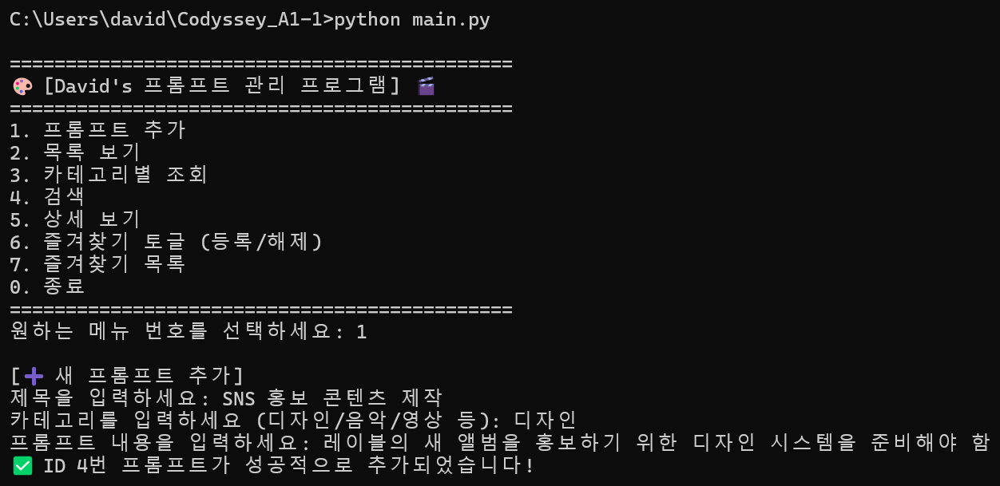
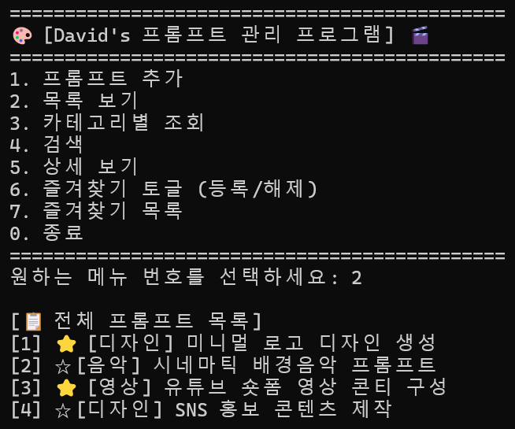
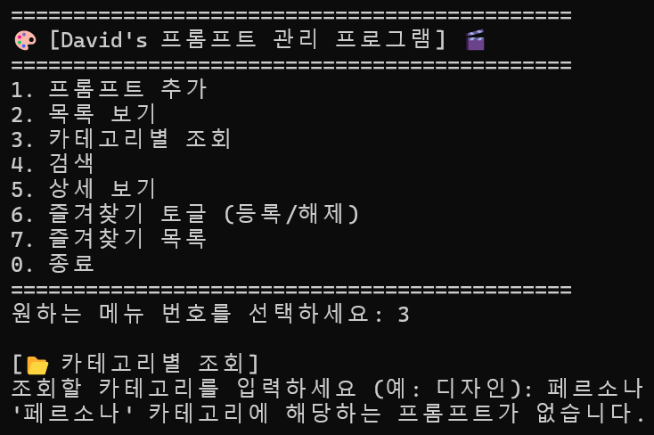
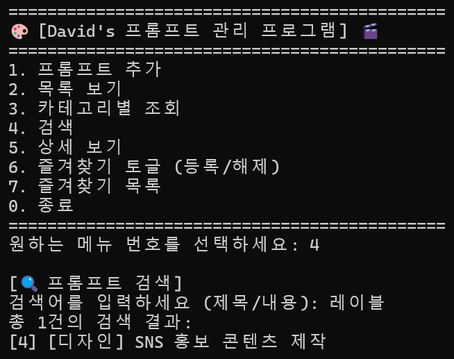
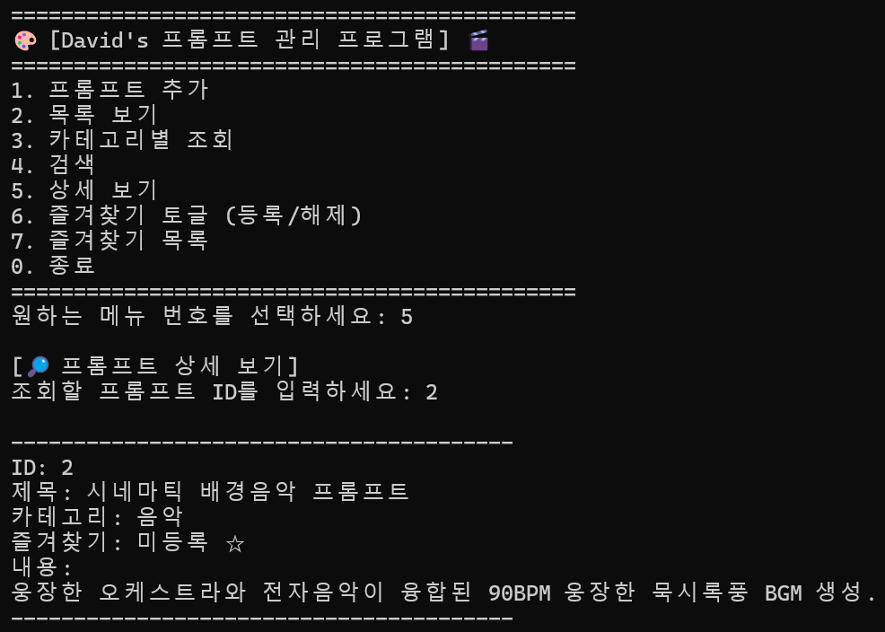
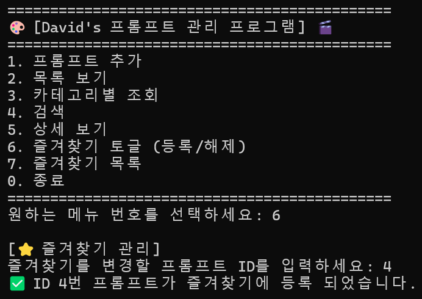
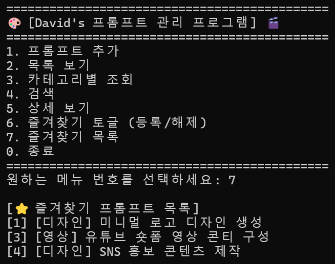
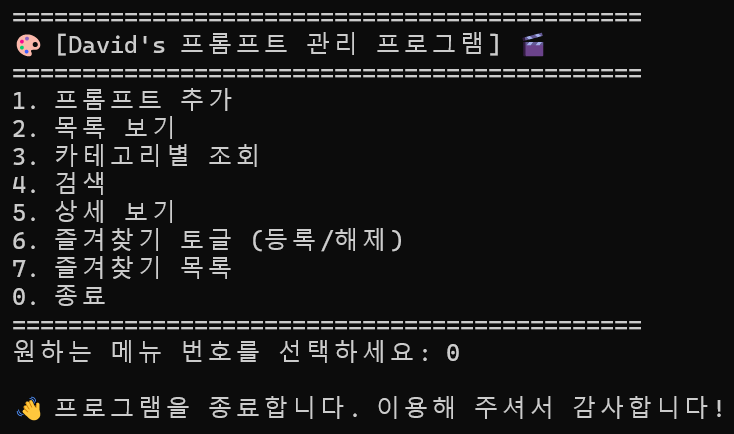
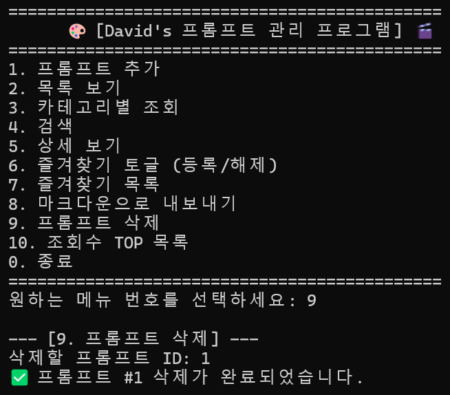
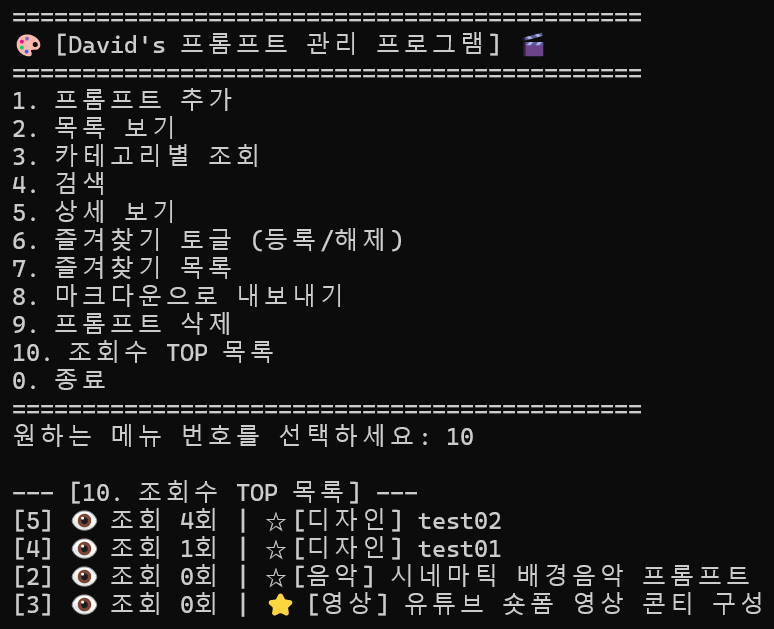

# Prompt Manager

생성형 AI 활용을 위한 콘솔 기반 프롬프트 관리 프로그램입니다.

## 주요 기능
| 번호 | 메뉴명 | 기능 설명 |
| :---: | :--- | :--- |
| **1** | **프롬프트 추가** | 제목, 내용, 카테고리를 입력받아 새로운 프롬프트 등록 |
| **2** | **프롬프트 목록** | 등록된 전체 프롬프트 목록 및 즐겨찾기 상태 조회 |
| **3** | **카테고리별 조회** | 디자인, 영상, 음악, 텍스트 등 카테고리별 필터링 |
| **4** | **프롬프트 검색** | 키워드를 통한 제목 및 본문 검색 |
| **5** | **프롬프트 상세 보기** | 프롬프트의 전체 내용과 속성 확인 |
| **6** | **즐겨찾기 토글** | 프롬프트 즐겨찾기 등록 및 해제 |
| **7** | **즐겨찾기 목록** | 즐겨찾기된 프롬프트만 모아보기 |
| **8** | **마크다운 내보내기** | 전체 프롬프트를 카테고리별 Markdown(`.md`) 파일로 자동 내보내기 |
| **9** | **프롬프트 삭제** | ID 번호를 입력하여 불필요한 프롬프트 영구 삭제 |
| **10** | **조회수 TOP 목록** | 프롬프트별 조회수를 기준으로 내림차순 정렬하여 인기 순위 조회 |
| **0** | **종료** | 프로그램 종료 및 `prompts.json` 파일에 데이터 영구 저장 |

## 실행 방법
```
python main.py
```

## 지원 카테고리
- 디자인
- 영상
- 음악
- 텍스트 생성
- 페르소나
- 자동화

## 기술 스택 및 특징
- Python Standard Library Only: 외부 패키지(pip) 설치 없이 순수 파이썬 기본 문법 사용 (json, os 모듈 활용)
- Data Persistence: prompts.json 파일을 통한 데이터 영속화(File I/O) 지원
- Modular Architecture: 단일 책임 원칙에 따라 기능별 독립 함수로 철저히 모듈화

## 실행 결과 화면
### 프롬프트 추가

### 프롬프트 목록

### 카테고리별 조회

### 프롬프트 검색

### 프롬프트 상세 보기

### 즐겨찾기 토글

### 즐겨찾기 목록

### 마크다운 내보내기

### 프롬프트 삭제

### 조회수 TOP 목록

### 종료

